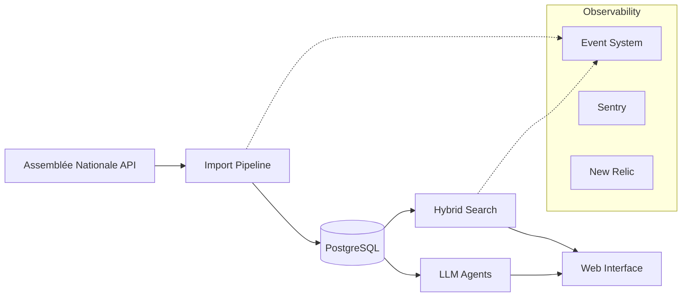

# Saumon Druid

> Agentic RAG system for querying French National Assembly (Assemblée Nationale) open data using natural language

> **Public Mirror** — This is a read-only snapshot of a private repository, shared for portfolio purposes. Some files are intentionally omitted. The project is under active development.

---

## Architecture

## Engineering Highlights

**Observability** — Single `track_event` entry point for all instrumentation. Events are persisted to TimescaleDB for audit, then asynchronously routed to Sentry (errors) and New Relic (metrics). No scattered `Rails.logger` or direct SDK calls.

**Data Lineage** — ETL pipeline with transaction safety: all-or-nothing imports with automatic rollback. Each run tracks processed/created/updated/skipped/failed counts. Supports incremental sync via date filtering.

**Hybrid Search** — Combines French full-text search (stemming, stopwords) with trigram fuzzy matching and pgvector semantic embeddings. Weighted scoring adapts to query type.

**LLM Agents** — YAML-configured agents with schema-validated inputs/outputs. Decouples prompt engineering from code.

## Tech Stack

| Layer | Technology |
|-------|--------|
| Framework | Rails 8.0 |
| Database | PostgreSQL + pgvector + TimescaleDB |
| Background Jobs | Sidekiq |
| Deployment | Docker |
| Monitoring | Sentry + New Relic |

## License

Private - All rights reserved
